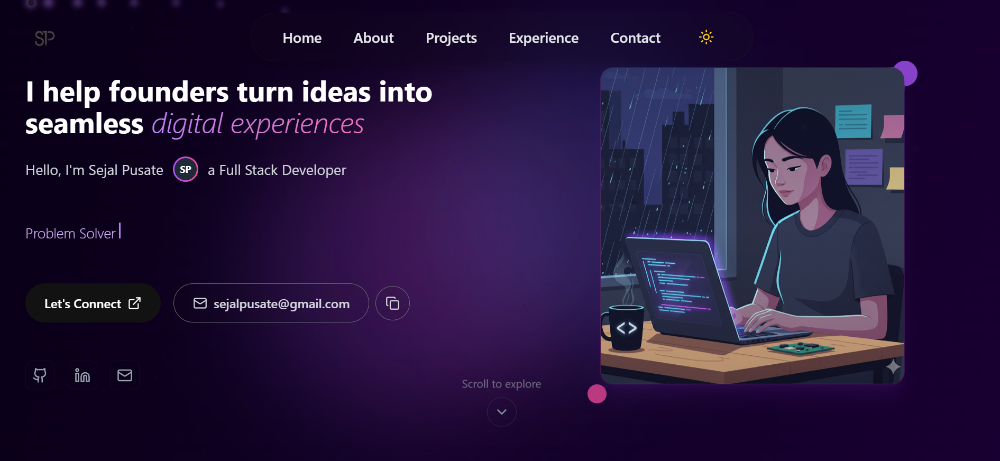

# 🌐 Sejal Pusate – Developer & Problem Solver

 <!-- Optional: Add a screenshot of your homepage -->

Welcome to the repository of my **personal portfolio website** – a fully responsive, modern, and interactive site built to showcase my projects, skills, and experience as a **Full-Stack Developer**.  


---

## 🚀 Features

- 🎨 **Glassmorphism + Modern UI** – Smooth, aesthetic interface with curved navbar & glowing gradients.
- 🌓 **Dark & Light Mode Toggle** – Instant theme switching with smooth transitions.
- ⚡ **Framer Motion Animations** – Elegant entry animations & hover effects.
- 🖱️ **Custom Mouse Follower** – Adds a unique interactive feel.
- 📱 **Fully Responsive** – Works beautifully on all devices.
- 📨 **EmailJS Contact Form** – Secure, API-powered contact form that sends messages directly to my inbox.
- 🎭 **Dynamic Sections** – Home, About, Projects, Experience, Contact – all animated with scroll effects.

---

## 🛠️ Tech Stack

| Category        | Tech |
|-----------------|------|
| **Frontend**    | React (Vite) + TailwindCSS + Framer Motion |
| **Deployment**  | Vercel |
| **Forms & Email** | EmailJS |
| **Version Control** | Git + GitHub |

---

## 📂 Project Structure

📦 portfolio
┣ 📂 public
┣ 📂 src
┃ ┣ 📂 Components # Navbar, MouseFollower, etc.
┃ ┣ 📂 Pages # Home, About, Projects, Experience, Contact
┃ ┗ App.jsx
┣ .env # API keys (ignored by Git)
┣ .gitignore
┣ package.json
┗ README.md


## 🧑‍💻 Getting Started (Run Locally)

1. Clone the repository:

```bash
git clone https://github.com/your-username/portfolio.git
cd portfolio
```
2. Install dependencies:

```bash
npm install
```

3. Run development server:

```bash
npm run dev
```

4. Build for production:

```bash
npm run build
```

## 🔑 Environment Variables
Create a .env file in the project root:

```bash
VITE_EMAILJS_SERVICE_ID=your_service_id
VITE_EMAILJS_TEMPLATE_ID=your_template_id
VITE_EMAILJS_PUBLIC_KEY=your_public_key
```

## 📬 Contact
📧 Email: sejalpusate@gmail.com

## 🏆 Future Improvements

🌎 Multi-language Support (English + Hindi)

📊 Analytics Integration

✨ More interactive 3D elements with react-three-fiber

## 📝 License
This project is open source